# Documentation UML — SONAS

> **Projet :** TFC_Francesco — Plateforme de gestion immobilière & sinistres  
> **Stack :** Django 5, PostgreSQL/SQLite, TailwindCSS, Alpine.js  
> **Version document :** Juillet 2026

Ce document regroupe l'ensemble de la modélisation UML de l'application SONAS : diagrammes de cas d'utilisation (DCU), diagrammes de classes, diagrammes d'états, diagrammes de séquence, diagrammes de composants et de déploiement. Les schémas utilisent la syntaxe **Mermaid** (compatible GitHub, VS Code, Notion).

---

## Table des matières

1. [Contexte et périmètre](#1-contexte-et-périmètre)
2. [Acteurs du système](#2-acteurs-du-système)
3. [Diagramme de cas d'utilisation (DCU) — vue globale](#3-diagramme-de-cas-dutilisation-dcu--vue-globale)
4. [DCU détaillé par acteur](#4-dcu-détaillé-par-acteur)
5. [Diagramme de classes](#5-diagramme-de-classes)
6. [Diagrammes d'états](#6-diagrammes-détats)
7. [Diagrammes de séquence](#7-diagrammes-de-séquence)
8. [Diagramme de composants](#8-diagramme-de-composants)
9. [Diagramme de déploiement](#9-diagramme-de-déploiement)
10. [Matrice acteur × cas d'utilisation](#10-matrice-acteur--cas-dutilisation)
11. [Références code source](#11-références-code-source)

---

## 1. Contexte et périmètre

SONAS est une application web Django destinée à la gestion de clients immobiliers, de biens, de contrats d'assurance, de sinistres, de documents et de notifications. Elle repose sur une **séparation stricte** de deux espaces :

| Espace | URL de base | Acteurs autorisés |
|--------|-------------|-------------------|
| **Client (self-service)** | `/client/*` | Client uniquement |
| **Interne (opérations)** | `/sonas/*` | Agent, Gérant, Administrateur |

### Mécanismes de sécurité

- **Modèle utilisateur :** `accounts.User` avec champ `role` (`UserRole`: CLIENT, AGENT, GERANT, ADMIN).
- **Décorateurs :** `core/decorators.py` — `client_required`, `internal_required`, `gerant_required`, `gerant_or_admin_required`, `admin_required`.
- **Middleware :** `RoleProtectionMiddleware` (`core/middleware.py`) — redirige un client tentant d'accéder à `/sonas/` vers `/client/`, et inversement pour le personnel interne.
- **Session :** expiration après 20 minutes d'inactivité.

### Frontière du système

**Inclus :** authentification, CRUD métier, workflow sinistre avec indemnisation et plafond contractuel, génération PDF contrat, notifications in-app, actions en attente, audit interne.

**Exclus :** paiement bancaire réel, signature électronique qualifiée (eIDAS), envoi email/SMS externe (simulé par notifications applicatives).

---

## 2. Acteurs du système

### 2.1 Client (`UserRole.CLIENT`)

- **Profil :** propriétaire ou professionnel immobilier utilisant l'espace self-service.
- **Dashboard :** `/client/`
- **Capacités :** déclarer biens et sinistres, souscrire contrats, consulter/uploader documents, gérer profil entreprise et paramètres compte, consulter notifications et rapports d'indemnisation.
- **Restrictions :** aucun accès à `/sonas/`, aucune validation métier.

### 2.2 Agent (`UserRole.AGENT`)

- **Profil :** opérateur de première ligne.
- **Dashboard :** `/sonas/`
- **Capacités :** validation biens, activation contrats, instruction sinistres, proposition indemnisation (Oui/Non + montant), transmission au gérant, gestion clients, consultation documentaire globale.
- **Restrictions :** ne peut pas clôturer/rejeter définitivement un sinistre, ne gère pas les agents.

### 2.3 Gérant (`UserRole.GERANT`)

- **Profil :** superviseur métier.
- **Capacités :** tout ce que fait l'agent, plus clôture/rejet sinistres, lancement indemnisation, gestion CRUD agents (`/sonas/agents/`).
- **Notifications :** reçoit les sinistres en attente de validation (`SINISTRE_A_VALIDER`).

### 2.4 Administrateur (`UserRole.ADMIN`)

- **Profil :** administration technique.
- **Capacités :** espace interne complet, clôture sinistres (comme gérant), logs audit (`/sonas/logs/`), gestion système (`/sonas/systeme/`), Django Admin (`/sonas/admin-secure/`).
- **Restrictions :** gestion agents réservée au gérant uniquement.

---

## 3. Diagramme de cas d'utilisation (DCU) — vue globale

```mermaid
flowchart TB
    subgraph Acteurs
        C((Client))
        A((Agent))
        G((Gérant))
        AD((Administrateur))
    end

    subgraph Espace_Client["Espace /client/"]
        UC1[S'inscrire / Se connecter]
        UC2[Gérer son profil]
        UC3[Déclarer un bien]
        UC4[Souscrire un contrat]
        UC5[Déclarer un sinistre]
        UC6[Consulter documents]
        UC7[Uploader des pièces]
        UC8[Consulter notifications]
    end

    subgraph Espace_Interne["Espace /sonas/"]
        UC9[Valider / rejeter un bien]
        UC10[Créer / activer un contrat]
        UC11[Instruire un sinistre]
        UC12[Proposer une indemnisation]
        UC13[Clôturer / rejeter un sinistre]
        UC14[Gérer les clients]
        UC15[Consulter tous les documents]
        UC16[Gérer les agents]
        UC17[Administration système]
        UC18[Consulter les logs d'audit]
    end

    C --> UC1 & UC2 & UC3 & UC4 & UC5 & UC6 & UC7 & UC8
    A --> UC9 & UC10 & UC11 & UC12 & UC14 & UC15
    G --> UC9 & UC10 & UC11 & UC12 & UC13 & UC14 & UC15 & UC16
    AD --> UC9 & UC10 & UC11 & UC12 & UC13 & UC14 & UC15 & UC17 & UC18
```

### Explication du DCU global

Le diagramme distingue **deux packages fonctionnels** correspondant aux deux frontières applicatives Django (`config/urls.py`).

**Relations « include » implicites :**

| Cas d'utilisation | Prérequis système |
|-------------------|-------------------|
| Déclarer un sinistre | Authentification + contrat ACTIF non bloqué + plafond disponible |
| Souscrire un contrat | Bien au statut VALIDE |
| Clôturer avec indemnisation | Proposition agent (`soumis_validation=True`) + validation gérant |
| Uploader un document | ACL : client = propriétaire ; interne = accès total |

**Generalisation entre acteurs internes :** Agent, Gérant et Admin partagent l'espace `/sonas/`. Le Gérant **spécialise** l'Agent (clôture sinistre, gestion agents). L'Admin **spécialise** le Gérant côté technique (logs, système, Django Admin).

---

## 4. DCU détaillé par acteur

### 4.1 Client — cas d'utilisation

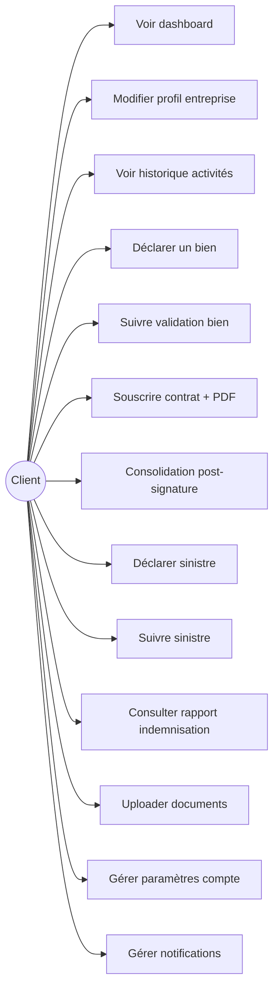

| ID | Cas d'utilisation | URL | Vue |
|----|-------------------|-----|-----|
| UC-C01 | Voir dashboard | `/client/` | `client_dashboard` |
| UC-C02 | Modifier profil | `/client/profil/` | `client_profile` |
| UC-C03 | Historique activités | `/client/activites/` | `client_activites` |
| UC-C04 | Déclarer bien | `/client/biens/nouveau/` | `bien_create_client` |
| UC-C05 | Détail bien | `/client/biens/<pk>/` | `bien_detail_client` |
| UC-C06 | Souscrire contrat | `/client/contrats/nouveau/` | `contrat_create_client` |
| UC-C07 | Consolidation | `/client/contrats/<pk>/consolidation/` | `contrat_consolidation_client` |
| UC-C08 | Déclarer sinistre | `/client/sinistres/nouveau/` | `sinistre_create_client` |
| UC-C09 | Détail sinistre | `/client/sinistres/<pk>/` | `sinistre_detail_client` |
| UC-C10 | Rapport indemnisation | `/client/sinistres/rapports/<pk>/` | `rapport_indemnisation_detail` |
| UC-C11 | Upload document | `/client/documents/upload/` | `document_upload` |
| UC-C12 | Paramètres compte | `/accounts/parametres/` | `settings_view` |
| UC-C13 | Notifications | `/client/notifications/` | `notification_list` |

### 4.2 Agent / Gérant / Admin — cas d'utilisation internes

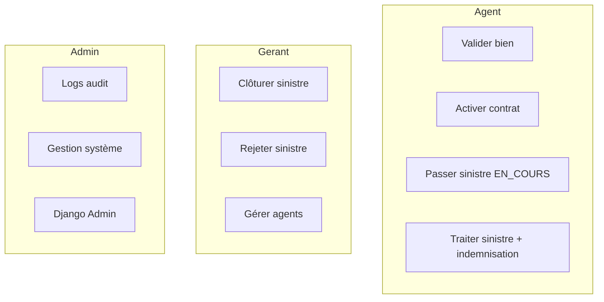

| ID | Cas d'utilisation | URL | Accès |
|----|-------------------|-----|-------|
| UC-I09 | Valider/rejeter bien | `/sonas/biens/<pk>/valider/` | `internal_required` |
| UC-I13 | Activer contrat | `/sonas/contrats/<pk>/activer/` | `internal_required` |
| UC-I17 | Passer EN_COURS | `/sonas/sinistres/<pk>/statut/` | `internal_required` |
| UC-I18 | Traiter sinistre | `/sonas/sinistres/<pk>/traiter/` | `internal_required` |
| UC-V01 | Clôturer/rejeter | `/sonas/sinistres/<pk>/valider/` | `gerant_or_admin_required` |
| UC-G01 | Liste agents | `/sonas/agents/` | `gerant_required` |
| UC-A02 | Logs | `/sonas/logs/` | `admin_required` |

---

## 5. Diagramme de classes

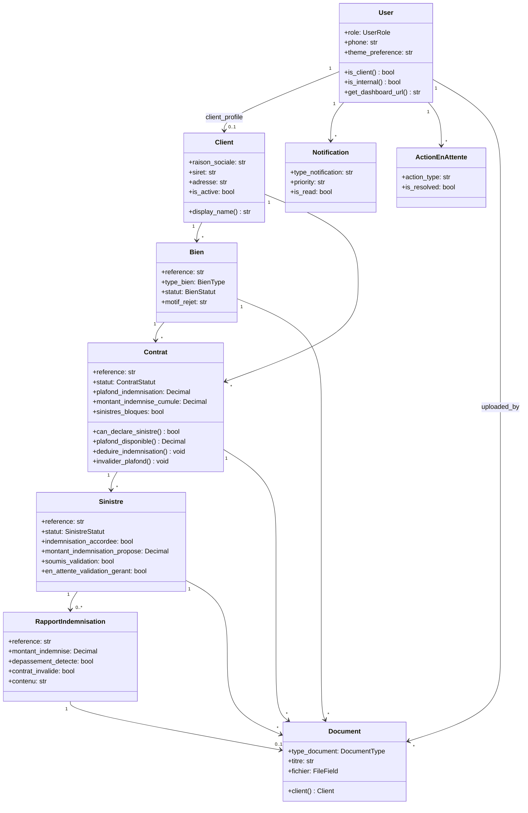

### Explication du modèle de classes

**Agrégat Client** — racine du self-service. Un `User` CLIENT possède exactement un `Client` (signal `clients/signals.py`). Le client agrège ses biens, contrats et activités.

**Agrégat Contrat** — pivot assurance. Lie `Client` + `Bien`. Porte le plafond d'indemnisation (`plafond_indemnisation`) et le cumul (`montant_indemnise_cumule`). Méthodes métier : `can_declare_sinistre()`, `deduire_indemnisation()`, `invalider_plafond()`.

**Agrégat Sinistre** — workflow le plus complexe. Champs de workflow : `traite_par`, `soumis_validation`, `indemnisation_accordee`, `montant_indemnisation_propose`. Produit un `RapportIndemnisation` à la clôture avec indemnisation.

**Document polymorphe** — règle `clean()` : exactement un lien parmi `bien`, `sinistre`, `contrat`. Property `client` remonte au client via l'entité liée.

**Applications Django :** `accounts`, `clients`, `biens`, `contrats`, `sinistres`, `documents`, `notifications`, `core`.

---

## 6. Diagrammes d'états

### 6.1 Bien

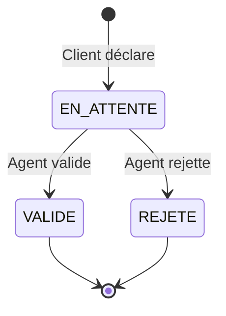

**Fichier :** `biens/models.py` — `BienStatut`. Transition via `bien_validate` (`biens/views.py`).

### 6.2 Contrat

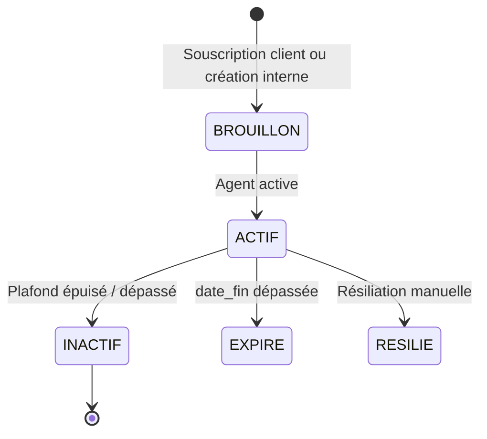

**Fichier :** `contrats/models.py` — `ContratStatut`. Passage INACTIF via `invalider_plafond()` lors d'une indemnisation dépassant le plafond.

### 6.3 Sinistre

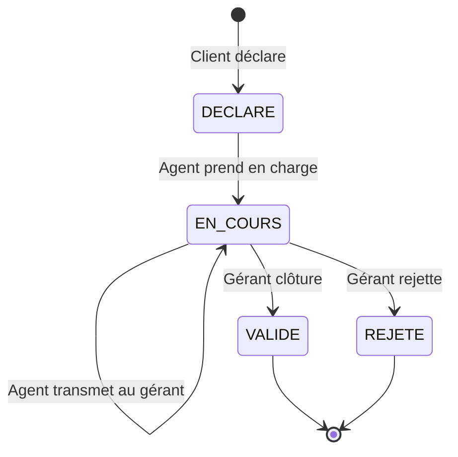

**Note :** pendant `EN_COURS` + `soumis_validation=True`, le sinistre est **en attente du gérant** (`en_attente_validation_gerant`).

---

## 7. Diagrammes de séquence

### 7.1 Authentification et redirection

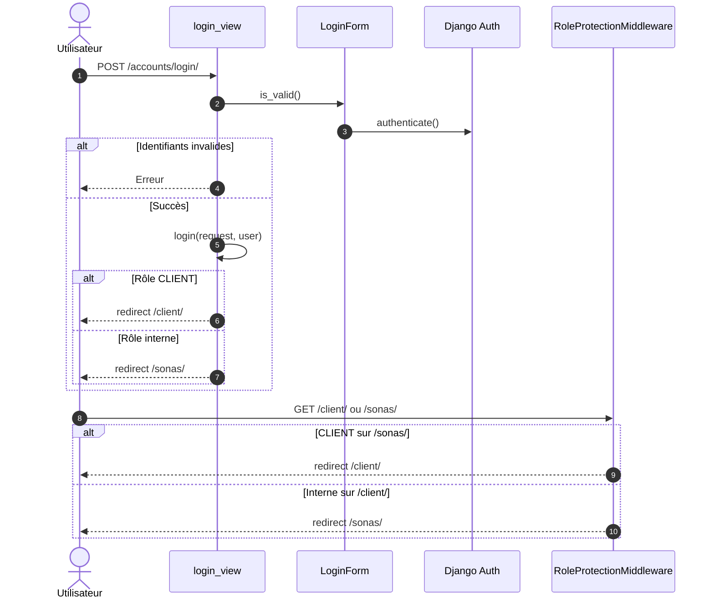

**Explication :** `LoginForm` (`accounts/forms.py`) authentifie et vérifie `is_active`. `User.get_dashboard_url()` route selon le rôle. Le middleware garantit l'isolation des espaces. Inscription (`register_view`) crée `User(CLIENT)` + `Client` via signal, puis login automatique.

---

### 7.2 Déclaration d'un bien

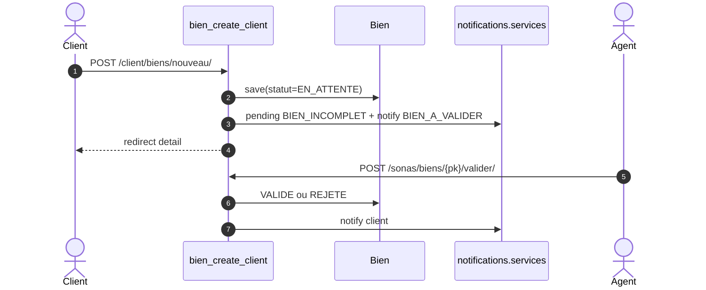

---

### 7.3 Souscription contrat + PDF

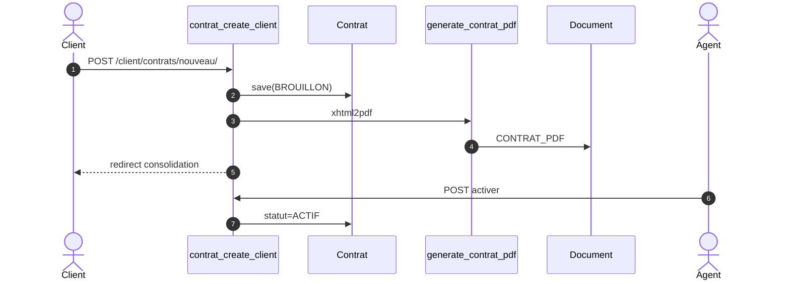

---

### 7.4 Déclaration sinistre

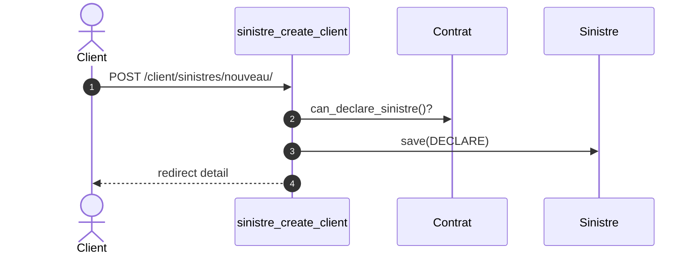

**Prérequis :** contrat ACTIF, `sinistres_bloques=False`, plafond disponible > 0.

---

### 7.5 Traitement agent + indemnisation

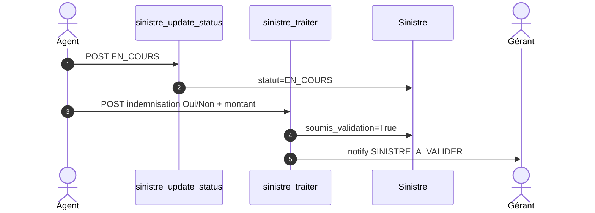

**Règle :** seul le gérant/admin clôture (`sinistre_validate`, `@gerant_or_admin_required`).

---

### 7.6 Clôture gérant avec indemnisation

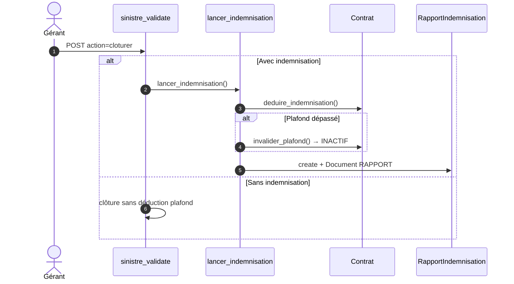

**Service :** `sinistres/services.py` — `lancer_indemnisation()`.

---

### 7.7 Upload document

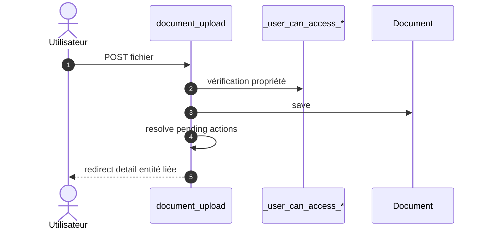

**Recherche interne :** `/sonas/documents/` — filtres `client`, `type`, `q` (`documents/services.py`).

---

## 8. Diagramme de composants

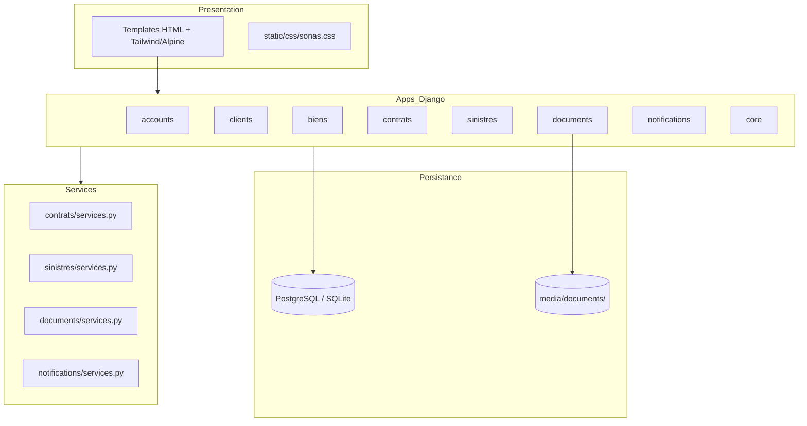

| Couche | Rôle |
|--------|------|
| Views | HTTP, décorateurs rôle, orchestration |
| Forms | Validation entrée utilisateur |
| Services | PDF, indemnisation, notifications |
| Models | Persistance, règles métier |
| Middleware | Auth, audit POST, session timeout |

---

## 9. Diagramme de déploiement

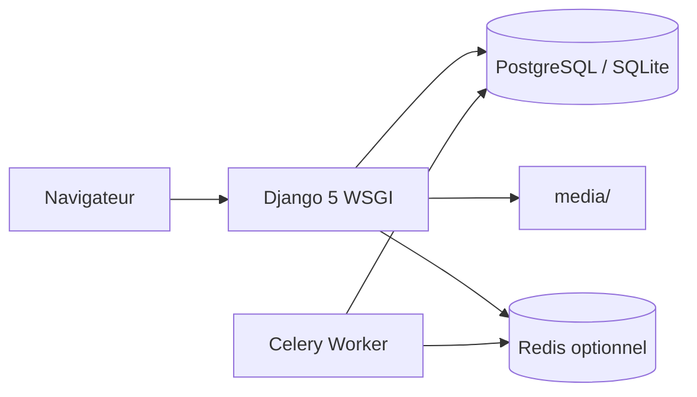

---

## 10. Matrice acteur × cas d'utilisation

| Cas d'utilisation | Client | Agent | Gérant | Admin |
|-------------------|:------:|:-----:|:------:|:-----:|
| S'inscrire | ✅ | — | — | — |
| Déclarer bien | ✅ | ✅* | ✅* | ✅* |
| Valider bien | ❌ | ✅ | ✅ | ✅ |
| Souscrire contrat | ✅ | ✅* | ✅* | ✅* |
| Activer contrat | ❌ | ✅ | ✅ | ✅ |
| Déclarer sinistre | ✅ | ✅* | ✅* | ✅* |
| Traiter sinistre | ❌ | ✅ | ✅ | ✅ |
| Clôturer sinistre | ❌ | ❌ | ✅ | ✅ |
| Gérer agents | ❌ | ❌ | ✅ | ❌ |
| Logs / système | ❌ | ❌ | ❌ | ✅ |
| Paramètres compte | ✅ | ✅ | ✅ | ✅ |
| Recherche documents | ❌ | ✅ | ✅ | ✅ |

*\* = création au nom d'un client (espace interne)*

---

## 11. Références code source

| Élément | Fichier |
|---------|---------|
| Modèle User / rôles | `accounts/models.py` |
| Login / paramètres | `accounts/views.py` |
| Middleware rôles | `core/middleware.py` |
| Décorateurs accès | `core/decorators.py` |
| Modèle Client | `clients/models.py` |
| Modèle Bien | `biens/models.py` |
| Modèle Contrat + plafond | `contrats/models.py` |
| PDF contrat | `contrats/services.py` |
| Modèle Sinistre | `sinistres/models.py` |
| Indemnisation | `sinistres/services.py` |
| Vues sinistre | `sinistres/views.py` |
| Documents + filtres | `documents/models.py`, `documents/services.py` |
| Notifications | `notifications/services.py` |
| URLs racine | `config/urls.py` |

---

## Export Word

Une version Word de ce document est disponible : [`UML_SONAS.docx`](UML_SONAS.docx)

Pour regénérer le fichier Word :

```bash
python scripts/generate_uml_docx.py
```

---

*Document généré pour le TFC SONAS — Francesco.*
